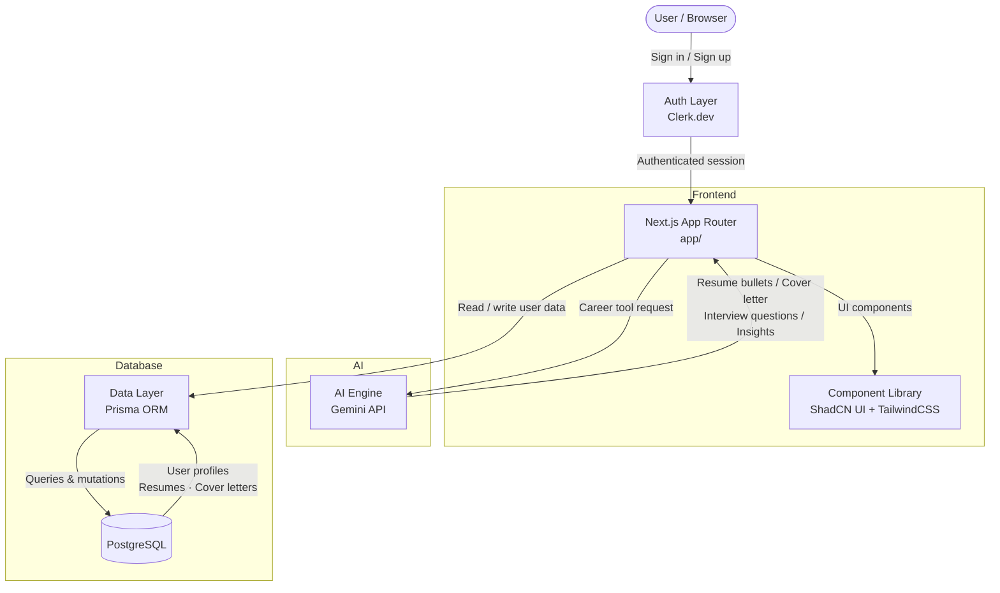

# PathFinder AI — Architecture

This document gives new contributors a quick mental model of how PathFinder AI is structured, how a user request flows through the system, and which files to open first.

---

## System Flow

---

## Layer Breakdown

### 1. Auth — Clerk.dev
Handles all authentication: sign-up, sign-in, session management, and route protection. Configured via environment variables (`NEXT_PUBLIC_CLERK_PUBLISHABLE_KEY`, `CLERK_SECRET_KEY`). Supports **keyless mode** for local development — auth routes degrade gracefully without API keys, making frontend work possible without a Clerk account.

### 2. App Router — `app/`
The Next.js 14 App Router is the backbone of the platform. Every page, layout, and API route lives here. Key sub-routes include onboarding (`/onboarding`), the resume builder, cover letter generator, interview prep, and the industry insights dashboard. Server components fetch data directly; client components handle interactivity.

### 3. AI Engine — Gemini API (`lib/`)
All AI features are powered by Google's Gemini API. Prompts are constructed in `lib/` utilities and sent server-side to avoid exposing the API key. The engine handles four workflows: resume bullet generation, cover letter writing, interview question generation, and career guidance. Prompt engineering and fallback handling are critical here.

### 4. Data Layer — Prisma ORM + PostgreSQL (`prisma/`)
`prisma/schema.prisma` defines all data models (users, resumes, cover letters, etc.). Prisma Client is the only way to interact with the PostgreSQL database — no raw SQL. Run `npx prisma generate` after schema changes and `npx prisma migrate dev` to apply them locally.

### 5. UI Layer — `components/` + `hooks/` + `styles/`
Reusable UI components are built with **ShadCN UI** (accessible, unstyled primitives) styled with **TailwindCSS**. Custom hooks in `hooks/` encapsulate client-side logic. Global styles live in `styles/`. All components must be responsive and accessible.

### 6. Shared Utilities — `utils/` + `constants/` + `lib/`
`utils/` holds helper functions, `constants/` stores app-wide static values, and `lib/` contains integrations (Prisma client singleton, Gemini API wrappers, etc.).

---

## Key Files

| File / Folder | What it does |
|---|---|
| `app/` | All pages, layouts, and API routes (Next.js App Router) |
| `prisma/schema.prisma` | Database schema — all models defined here |
| `lib/` | Gemini API wrappers, Prisma client singleton, shared integrations |
| `components/` | Reusable UI components (ShadCN + Tailwind) |
| `hooks/` | Custom React hooks for client-side logic |
| `utils/` | Helper functions used across the app |
| `constants/` | App-wide static values |
| `.env.local` | Environment variables (never commit this) |

---

## Data Flow in Plain English

1. A user signs in via Clerk — session is established and protected routes become accessible.
2. The user fills out a form (e.g. resume details) in the Next.js frontend.
3. The app sends the input server-side to the Gemini API with a crafted prompt.
4. Gemini returns generated content (resume bullets, cover letter, interview questions, etc.).
5. The result is displayed in the dashboard and saved to PostgreSQL via Prisma.
6. On subsequent visits, the dashboard loads saved data directly from the database.

---

## Getting Oriented as a New Contributor

1. **Set up `.env.local`** with your Clerk, Gemini, and PostgreSQL credentials before running anything.
2. **Run `npx prisma generate && npx prisma migrate dev`** after cloning to get the database in sync.
3. **Start in `app/`** — find the page or route closest to what you want to change.
4. **AI changes go in `lib/`** — prompt engineering and Gemini API calls live there.
5. **UI changes go in `components/`** — follow the existing ShadCN + Tailwind patterns and test responsiveness.
6. **Schema changes** require updating `prisma/schema.prisma` and running a migration before anything else.
